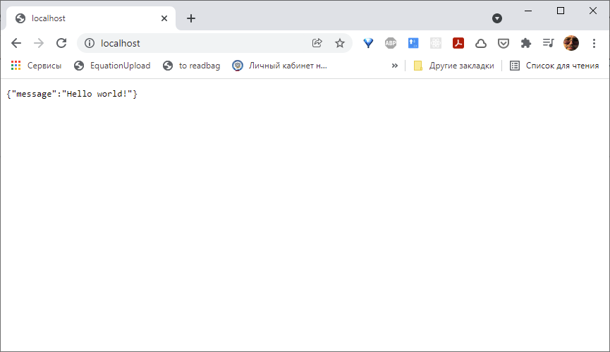

[SOFTSPIDERS](https://github.com/softspiders/softspiders)

# *Nginx* as a reverse proxy for *NodeJS* in *Docker Compose*

## Feature tags

- docker-compose
- nginx
- node
- reverse-proxy
- starter
- template

---

## Parents

- [**- node, reverse-proxy**](https://github.com/AlexanderLapygin/nginx_docker-compose)

---

## Author

[Alexander Lapygin](https://github.com/AlexanderLapygin) <<alexanderlapygin@gmail.com>>

## Inspiration

Originate from [Docker compose example for NodeJS and Nginx Reverse Proxy](https://github.com/brycejech/node-docker-nginx)

---

## Requirements

- [Node.js](https://nodejs.org/en/download/package-manager/)
- [Docker Compose](https://docs.docker.com/compose/install/)

---

## Running

Execute 
```sh
docker-compose up
```

Then look at the [localhost](http://localhost) in browser. You should see a result like this:



---

### License

Licensed under the [MIT license](./LICENSE).
